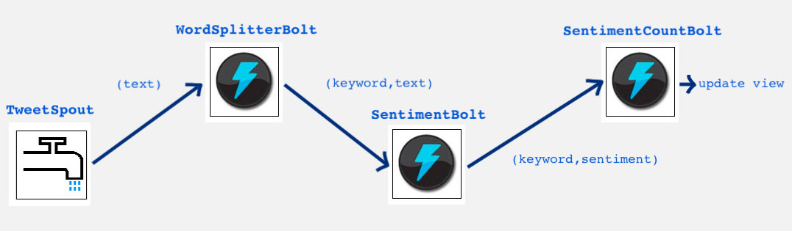

# Twitter-Sentiment-Analysis-LA
Social networks such as Twitter have gained great attention nowadays. The heavy presence of people on social networks causes a big amount of data ready to be analyzed. However, there are a lot of issues related to the reviewing of large chunks of information. 
The goal of this project is to present a functioning Lambda Architecture built to compute a sentiment analysis upon tweets, according to specific keywords.
The sentiment analysis or opinion mining is the process of determining if a particular block of text is expressing a positive or negative reaction upon something. Clearly, the rise of social media has fueled interest in sentiment analysis. Online opinion has turned into something to take into account by businesses looking to market their products, identify new opportunities and manage their reputations.

## Introduction to Lambda Architecture
Lambda Architecture has born as a solution to the processing of massive quantities of data. The main idea of the Lambda Architecture is to build Big Data systems as a series of three layers. The aim is to provide:
- Robustness and fault tolerance:
- Low latency reads and updates
- Scalability

## Architecture Overview
In this section are described the various components of the computation that is the Sentiment Analysis task, and the three layers of the Lambda Architecture.

### Sentiment Analysis
The realization of the Sentiment Analysis is carried out by making use of the LingPipe library (http://alias-i.com/lingpipe/index.html). To train the classifier has been used the dataset: https://www.kaggle.com/kazanova/sentiment140 and in order to simulate a continuous stream of tweets as input in the system has been adopted the dataset: https://github.com/guyz/twitter-sentiment-dataset.

At the start of the computation is chosen a set of keywords, upon which is done the sentiment analysis. If in a certain tweet is present at least one of this keywords, then the tweet must be classified in order to provide the proper sentiment.
The classifier is trained in such a way that is capable to recognize two levels of sentiment:
- A negative sentiment, using the label 0 
- A positive sentiment, with label 1

### Batch Layer
The Batch Layer is responsible for pre-computing batch views of the whole database. Each time a new batch view is available, the old one is not immediately discarded, not until the next one is ready. This is made possible by the fact that every time that a new batch view is computed, the system goes through the whole master database from scratch, taking into account even the older, and already computed records of the past batch view.

Each time a new view needs to be prepared, is performed a MapReduce processing on the whole master database. MapReduce is a framework composed of a map procedure, which executes some filtering and sorting, and a reduce method, which performs a counting operation. MapReduce is so important because it allows to orchestrates the processing of a massive amount of data, even distributed on different servers. 

In this particular case MapReduce is managed by taking as input for the Map function the whole master database. For each row of the database is checked if the tweet text contains at least a keyword. If that is the case is computed the sentiment of the tweet and outputted the pair (keyword, sentiment). The results are shuffled by the shuffle nodes, so that data based on the same output key (produced by the map function) is redistributed. By doing so all data belonging to one key is located on the same worker node making the performances better. The reducers are responsible for counting how many positive and negative tweets there are for that keyword. The final output is saved in the batch view table.

### Speed Layer

Of course because of the nature of the Batch Layer computation, for large database, generating a new batch view can take some time. This is why is extremely important to make available a layer that is capable of handling new tweets really fast, in order to integrate the batch view, that might not be up to date.
To provide this kind of structure, has been used the computation system Apache Storm. Apache Storm makes it easy to reliably process unbounded streams of data, doing for realtime processing what Hadoop did for batch processing. The general topology structure of Storm is similar to a MapReduce job, with the main difference being that data is processed in real time as opposed to in individual batches. The topology adopted can be described in the Figure below.

    <i>Storm Topology:</i>

  

For each tweet is stored the date, the timestamp and the text in the master database (HBase), in order to maintain a raw version of the tweet in the system. The last bolt completes the speed layer job, putting together the count of positive and negative sentiment for each keyword and storing the result in the speed layer view in HBase.

### Serving Layer

The Serving Layer plays the role of a supervisor of both Batch and Speed layers. It is responsible for querying the Hbase database in order to get an instance of batch view and real-time view. Once the data from both tables is retrieved, the Serving Layer is in charge of merging the two views, obtaining a full view of the sentiment of each keyword for the whole database. The crucial aspect of the serving layer to pay particular attention to, is how the synchronization between the two layers is performed.

The technique adopted consists in having always at hand two batch views. After the computation of a batch view through MapReduce, the result is copied back to a consistent batch view henceforth called BatchViewComplete. The other batch view table, BatchViewInComputation can be used for another computation. Each time a new batch view is ready, the realtime view table is initialized, so that the new tweets that will arrive from that moment forward will be analyzed and saved to guarantee consistency with the master database.

At any given time the two tables (realtime and batchComplete) can be queried and the result of the sum of both values is used to print out the complete view of the database.
